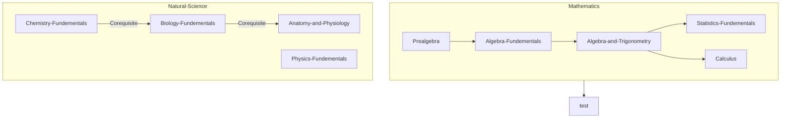

# test

```mermaid

graph TD
	subgraph Mathematics
		Prealgebra --> Algebra-Fundementals
		Algebra-Fundementals --> Algebra-and-Trigonometry
		Algebra-and-Trigonometry --> Statistics-Fundementals
		Algebra-and-Trigonometry --> Calculus
	end

	Mathematics --> test


	subgraph Natural-Science
		Chemistry-Fundementals
		Physics-Fundementals

		Chemistry-Fundementals-->|Corequisite| Biology-Fundementals

		Biology-Fundementals -->|Corequisite| Anatomy-and-Physiology

	end


```