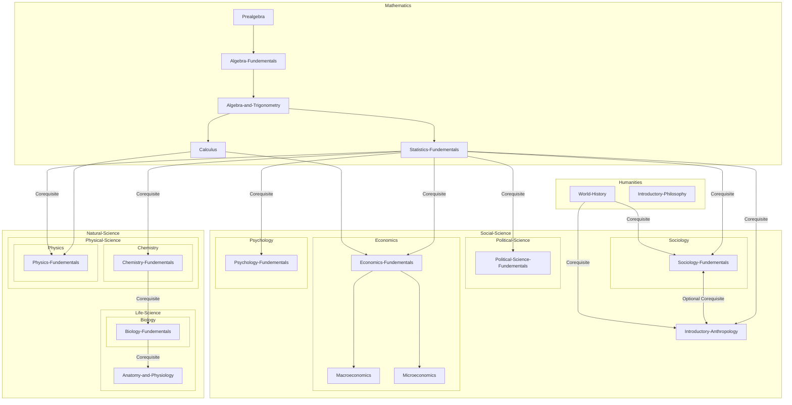

# test

```mermaid

graph TD
	subgraph Mathematics
		Prealgebra ---> Algebra-Fundementals
		Algebra-Fundementals ---> Algebra-and-Trigonometry
		Algebra-and-Trigonometry ---> Statistics-Fundementals
		Algebra-and-Trigonometry ---> Calculus
	end

	Calculus ---> Physics-Fundementals

	Statistics-Fundementals-->|Corequisite| Chemistry-Fundementals
	Statistics-Fundementals-->|Corequisite| Physics-Fundementals

	subgraph Natural-Science
		subgraph Physical-Science
			subgraph Chemistry
				Chemistry-Fundementals
			end
			subgraph Physics
				Physics-Fundementals
			end
		end

		Chemistry-Fundementals-->|Corequisite| Biology-Fundementals

		subgraph Life-Science
			subgraph Biology
				Biology-Fundementals
			end
			Biology-Fundementals -->|Corequisite| Anatomy-and-Physiology
		end
	end

	Statistics-Fundementals-->|Corequisite| Political-Science-Fundementals
	Statistics-Fundementals-->|Corequisite| Introductory-Anthropology
	Statistics-Fundementals-->|Corequisite| Sociology-Fundementals
	Statistics-Fundementals-->|Corequisite| Economics-Fundementals
	Statistics-Fundementals-->|Corequisite| Psychology-Fundementals

	Calculus ---> Economics-Fundementals

	subgraph Social-Science
		subgraph Political-Science
			Political-Science-Fundementals
		end

		Sociology-Fundementals <-->|Optional Corequisite| Introductory-Anthropology

		subgraph Sociology
			Sociology-Fundementals
		end

		subgraph Economics
			Economics-Fundementals
			Economics-Fundementals ---> Macroeconomics
			Economics-Fundementals ---> Microeconomics
		end

		subgraph Psychology
			Psychology-Fundementals
		end
	end

	World-History -->|Corequisite| Sociology-Fundementals
	World-History -->|Corequisite| Introductory-Anthropology

	subgraph Humanities
		World-History
		Introductory-Philosophy
	end

```