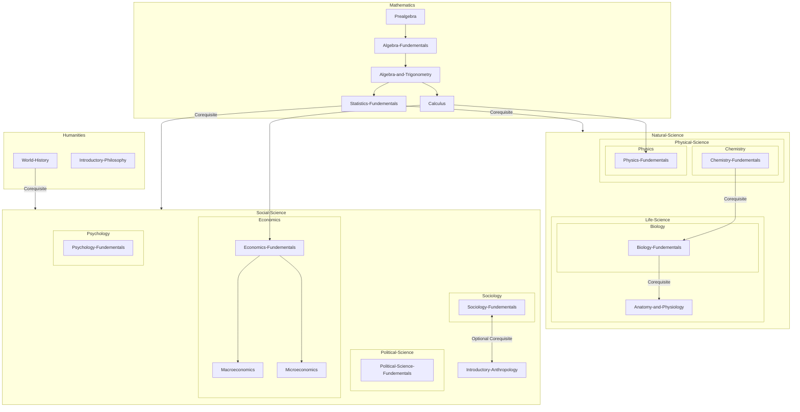

# test

```mermaid

graph TD
	subgraph Mathematics
		Prealgebra --> Algebra-Fundementals
		Algebra-Fundementals --> Algebra-and-Trigonometry
		Algebra-and-Trigonometry --> Statistics-Fundementals
		Algebra-and-Trigonometry --> Calculus
	end

	Calculus --> Physics-Fundementals

	Statistics-Fundementals -->|Corequisite| Natural-Science

	subgraph Natural-Science
		subgraph Physical-Science
			subgraph Chemistry
				Chemistry-Fundementals
			end
			subgraph Physics
				Physics-Fundementals
			end
		end

		Chemistry-Fundementals -->|Corequisite| Biology-Fundementals

		subgraph Life-Science
			subgraph Biology
				Biology-Fundementals
			end
			Biology-Fundementals -->|Corequisite| Anatomy-and-Physiology
		end
	end

	Statistics-Fundementals -->|Corequisite| Social-Science

	Calculus ---> Economics-Fundementals

	subgraph Humanities
		World-History
		Introductory-Philosophy
	end

    World-History -->|Corequisite| Social-Science

	subgraph Social-Science
		subgraph Political-Science
			Political-Science-Fundementals
		end

		Sociology-Fundementals <-->|Optional Corequisite| Introductory-Anthropology

		subgraph Sociology
			Sociology-Fundementals
		end

		subgraph Economics
			Economics-Fundementals
			Economics-Fundementals ---> Macroeconomics
			Economics-Fundementals ---> Microeconomics
		end

		subgraph Psychology
			Psychology-Fundementals
		end
	end

```